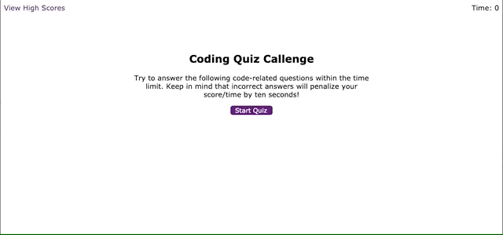

# Code Quiz!

A timed code quiz with multiple-choice questions. This app runs in the browser
and is powered by JavaScript.

## Purpose

Provide coding bootcamp and other students an opportunity to test their
JavaScript skills and gauge their progress against their peers.

## How It Works

- Click the `Start Quiz` button to start the timer and get the first question
- Answer questions by clicking the appropriate button among multiple options
- Selecting an incorrect answer will subtract time from the timer
- After each answer, another question is presented, unless all questions have
  been answered or the timer has reached 0
- Once all questions are answered or the timer reaches 0, the quiz is done
- When the quiz is done, enter your initials to save your score
- Scores can be viewed at any time by clicking the "View Highscores" link in
  the header
- Highscores can be cleared on the "View Highscores" screen

The following animation demonstrates the application functionality:

